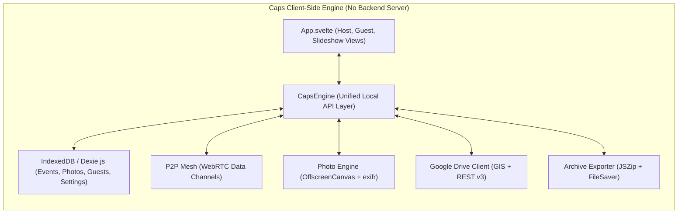

# Implementation Plan: Converting Caps to a Server-less Web App (Approach A: Sonata Model)

Transition **Caps** from a Node.js/Express/SQLite server-based application into a **100% serverless, client-driven Single Page Application (SPA)** matching the **Sonata** architecture. 

In this model:
1. The app is hosted statically on **Vercel** / **GitHub Pages** with zero backend infrastructure.
2. All data (events, photos, guests, settings) is stored locally in the browser using **IndexedDB (Dexie.js)**.
3. Photos are processed (resizing, thumbnails, duplicate SHA-256 hashing, EXIF stripping) client-side via **OffscreenCanvas / Web Workers** and **`exifr`**.
4. Real-time communication between Host, Guest phones, and TV Slideshow operates peer-to-peer via **WebRTC Data Channels** (using `trystero`/`peerjs`).
5. Cloud backup and multi-device archive sync connect directly to the Host's **Google Drive** using client-side **Google Identity Services (GIS)** with restricted `drive.file` OAuth scope.
6. ZIP exports run entirely in-browser using **`JSZip`**.

---

## User Review Required

> [!IMPORTANT]
> **Host Device Role in Approach A**:
> In this peer-to-peer serverless architecture, the Host device (laptop or tablet running the Host Dashboard / Slideshow) serves as the authoritative WebRTC room coordinator. When guests take photos, their mobile browsers stream photos directly to the Host's browser via WebRTC data channels, which saves them to IndexedDB and syncs to Google Drive.
> 
> If the host's browser tab is closed, guests will queue photos offline in their local IndexedDB and automatically flush them once the host reconnects.

> [!NOTE]
> **Google Drive OAuth Client ID**:
> Direct Google Drive sync requires a Google Cloud OAuth 2.0 Client ID with authorized JavaScript origins (e.g., `https://caps.vercel.app` and `http://localhost:5173`). A default or user-configurable Client ID input will be provided in the Host Settings UI so users can connect their own Google Drive seamlessly.

---

## Proposed Changes



---

### Core Dependencies & Build Configuration

#### [MODIFY] [`client/package.json`](file:///d:/Projects/caps/client/package.json)
- Add required client-side libraries:
  - `dexie` (Fast, ergonomic IndexedDB wrapper for relational queries and reactive live queries)
  - `trystero` (Zero-config WebRTC peer-to-peer data channels with public BitTorrent/Nostr/MQTT tracker signaling)
  - `exifr` (Fast client-side EXIF orientation & metadata parser)
  - `jszip` & `file-saver` (Client-side ZIP generation for full event archives)
  - `qrcode` (Browser-native QR code rendering)

#### [NEW] [`vercel.json`](file:///d:/Projects/caps/vercel.json)
- Add Vercel deployment configuration with SPA routing rewrites:
  ```json
  {
    "rewrites": [{ "source": "/(.*)", "destination": "/index.html" }]
  }
  ```

---

### Client Storage & Database Layer

#### [NEW] [`client/src/lib/db.js`](file:///d:/Projects/caps/client/src/lib/db.js)
- Implement IndexedDB database schema using `Dexie`:
  - `events`: `id, slug, name, date, tagline, moderation_enabled, guest_upload_limit, exif_strip, status, created_at`
  - `photos`: `id, event_slug, guest_id, guest_name, hash, status, original_blob, thumb_blob, width, height, size, mime_type, gdrive_file_id, created_at`
  - `guests`: `id, event_slug, name, token, upload_count, created_at`
  - `settings`: `id, host_name, pin_hash, gdrive_client_id, gdrive_token, gdrive_folder_id, theme`
  - `sync_logs`: `id, event_slug, photo_id, status, error, timestamp`
- Export reactive query helpers (`getEvents()`, `getPhotosByEvent()`, `updatePhotoStatus()`, etc.).

---

### Browser Photo Processing Engine

#### [NEW] [`client/src/lib/photo-engine.js`](file:///d:/Projects/caps/client/src/lib/photo-engine.js)
- **Duplicate Detection**: Compute SHA-256 hash using `crypto.subtle.digest('SHA-256', arrayBuffer)`.
- **EXIF Extraction & Stripping**: Use `exifr` to extract orientation and strip sensitive GPS/camera metadata if enabled.
- **Canvas Resizing**:
  - Render to HTML5 `OffscreenCanvas` / Canvas 2D.
  - Generate full-resolution optimized WebP/JPEG (max 2048px).
  - Generate lightweight 360px thumbnail for fast gallery rendering and low-bandwidth P2P transmission.

---

### Real-Time WebRTC P2P Layer

#### [NEW] [`client/src/lib/p2p-mesh.js`](file:///d:/Projects/caps/client/src/lib/p2p-mesh.js)
- Implement room-based P2P communication powered by `trystero/torrent` (BitTorrent tracker signaling) or `trystero/nostr`:
  - **Room ID**: `caps-event-<slug>`
  - **Host Actions**: Broadcast room presence, send event configuration, receive photo chunks, broadcast photo status changes (`approved`, `rejected`), broadcast slideshow updates.
  - **Guest Actions**: Join room, send `JOIN_EVENT` with guest name, transfer photo blobs and thumbnails in binary chunks with progress tracking, receive approved photo updates for the live gallery.
  - **Slideshow Actions**: Listen for `PHOTO_APPROVED` and real-time state sync.

---

### Google Drive Cloud Sync Layer (Sonata Model)

#### [NEW] [`client/src/lib/gdrive.js`](file:///d:/Projects/caps/client/src/lib/gdrive.js)
- Implement client-side Google Identity Services (GIS) OAuth 2.0:
  - Scope: `https://www.googleapis.com/auth/drive.file` (creates and manages only files created by Caps).
  - **Folder Structure**: Auto-create `/Caps Events/<Event Name>/` and subfolders `/originals` and `/thumbnails`.
  - **Photo Sync**: Multipart upload of image Blobs and `metadata.json` directly from browser to Google Drive.
  - **Manifest Backup**: Sync the event's complete database record (`event_manifest.json`) for seamless cross-device restore.

---

### Archive & ZIP Generation

#### [NEW] [`client/src/lib/archive.js`](file:///d:/Projects/caps/client/src/lib/archive.js)
- Replace server `archiver` with client-side `JSZip`:
  - Pack original photo Blobs, thumbnail Blobs, and a generated `metadata.json`.
  - Trigger direct browser download using `FileSaver.saveAs()`.

---

### Unified API & State Bridge

#### [MODIFY] [`client/src/lib/api.js`](file:///d:/Projects/caps/client/src/lib/api.js)
- Refactor `api` object methods to call local `db.js`, `photo-engine.js`, `p2p-mesh.js`, and `gdrive.js` rather than sending HTTP requests to a Node.js backend.
- Maintain interface compatibility with [`client/src/App.svelte`](file:///d:/Projects/caps/client/src/App.svelte) to minimize disruption to existing UI components.

---

### UI & Component Refactoring

#### [MODIFY] [`client/src/App.svelte`](file:///d:/Projects/caps/client/src/App.svelte)
- Update routing logic to support clean client-side hash routing (`/#/`, `/#/event/<slug>`, `/#/event/<slug>/slideshow`, `/#/host`).
- Add P2P connection indicator (showing connected guests and WebRTC health).
- Add Google Drive Sync modal / 1-click Connect button in Host Dashboard (Sonata style).
- Replace server URLs for photos (`/api/events/.../photos/.../file`) with `URL.createObjectURL(blob)` or IndexedDB cached image URLs.

---

## Verification Plan

### Automated & Build Tests
- Install dependencies and verify Vite build succeeds:
  ```powershell
  cd client
  npm install
  npm run build
  ```

### Manual & Multi-Device Verification
1. **Host Setup & Event Creation**:
   - Open app locally (`npm run dev`) or on Vercel preview.
   - Create a new event; verify event is stored in IndexedDB and visible on reload.
2. **Guest Mobile Join & P2P Upload**:
   - Open guest link (`/#/event/<slug>`) in a separate browser window or mobile device on the same/different network.
   - Capture/upload 3 photos; verify photos are resized client-side, chunked over WebRTC, and received in the Host moderation queue.
3. **Live Moderation & Slideshow Push**:
   - Approve a photo on the Host dashboard; verify the photo instantly appears in the Guest Live Gallery and TV Slideshow (`/#/event/<slug>/slideshow`) without refreshing.
4. **Google Drive Cloud Sync**:
   - Authenticate with Google Drive in Host Settings.
   - Trigger sync and verify folder `/Caps Events/<Event Name>` is created in Google Drive with uploaded photos and `manifest.json`.
5. **Full Archive Export**:
   - Click "Export Full Archive"; verify a `.zip` file is generated and downloaded containing all originals, thumbnails, and `metadata.json`.
6. **Offline Mode**:
   - Turn off Wi-Fi on guest device; take photos and verify they are placed in the offline queue, then auto-uploaded when network reconnects.
